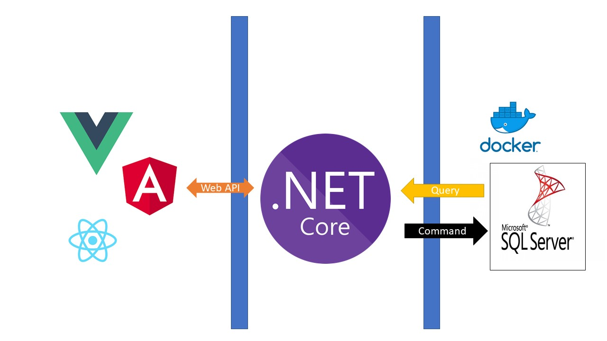

# .NET Core REST API server with CQRS



* youtube : https://coming_soon...

## Enviroment
* Stack: C#, ASP.NET Core 3.0 Web API
* OS: WSL2 (ubuntu 16.04)
* Editor: vScode
* DB: MS-SQL 2017

## docker commands

#### To start docker deamon
```
> service docker start 
```
#### To execute docker-compose.yml (Install ms-sql server)
```
> docker-compose up -d
```
#### To check created docker container
```
> docker ps -a
```
#### To start docker container
```
> docker start <container_ID>
```
#### To connect with sql server using CLI
```
> docker exec -it <container_ID> /opt/mssql-tools/bin/sqlcmd -S localhost -U sa -P yourPassword
```


## ConnectionString
* Server=[Docker_Container_IP],[Port];Database=<Your_DB_table_name>;User Id=sa;Password=YourPassword
#### How to get docker container ip?
* docker inspect <Container_ID>
